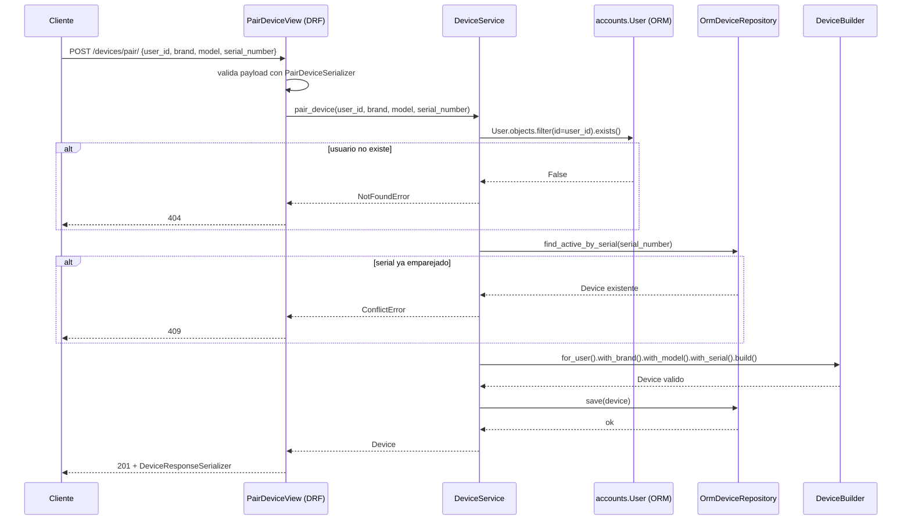

# Entrega No. 1: Nucleo de Negocio y Exposicion de API Profesional

## 1. Justificacion de la estructura de carpetas

El proyecto se organiza por **modulo de negocio** (`accounts`, `subscriptions`, `devices`) y no por tipo tecnico, para que cada modulo pueda evolucionar, probarse y eventualmente desplegarse por separado. Dentro de cada modulo se repite la misma arquitectura en capas usada en el Taller 01:

```
<modulo>/
  interfaces/    -> serializers.py + views.py (DRF). Solo traduce HTTP <-> llamadas al service.
  application/    -> services.py. Orquesta el caso de uso, es el unico lugar con logica de negocio.
  domain/         -> entities.py, builders.py, ports.py. Reglas de negocio puras, sin Django ni DB.
  infra/          -> models.py (ORM) y repositories.py. Implementa los ports contra la base de datos real.
common/
  exceptions.py  -> NotFoundError / ConflictError, compartidas entre modulos para mapear a 404 / 409
                     sin acoplar los services a codigos HTTP.
```

Repetir esta misma carpeta en `accounts`, `subscriptions` y `devices` deja evidencia de que el patron del
Taller 01 no fue un caso aislado, sino el estandar del proyecto: la vista nunca decide con base de datos
habla, el service nunca sabe que existe HTTP, y el dominio nunca sabe que existe Django.

## 2. Diagrama de secuencia: emparejar un dispositivo (`POST /devices/pair/`)

Es el flujo mas complejo de la entrega porque combina: validacion contra otro modulo (`accounts`), una
regla de conflicto (serial ya emparejado) y el patron Builder para garantizar un objeto valido.



## 3. Preparacion para un API Gateway

El proyecto ya cumple las condiciones para sentarse detras de un Gateway (Kong, AWS API Gateway, etc.)
sin refactor mayor:

- **Rutas ya segmentadas por dominio**: `/users/*`, `/subscription/*`, `/devices/*` y `/plans/*` se
  incluyen como `urlpatterns` independientes por app. Un Gateway puede enrutar cada prefijo a un servicio
  distinto el dia que estos modulos se separen en despliegues independientes.
- **Sin estado compartido entre modulos**: `devices` y `subscriptions` nunca importan los modelos ORM del
  otro; solo se referencian por `user_id` (string). Esto es exactamente el contrato que un Gateway/API
  compuesta necesita para enrutar sin que un servicio dependa del proceso en memoria de otro.
- **Contrato estable via serializers**: los DRF serializers son la unica superficie publica; la capa de
  infra (ORM, in-memory) puede cambiar sin romper el contrato HTTP, que es lo que un Gateway expone y
  cachea.
- **Errores de negocio ya normalizados**: `NotFoundError` / `ConflictError` se traducen siempre a 404/409
  en la capa `interfaces/`, dando respuestas HTTP consistentes entre modulos, algo que un Gateway espera
  para poder aplicar politicas comunes (rate limiting, reintentos, circuit breaking) sin logica especial
  por servicio.

## 4. Patrones creacionales de esta entrega

- **Builder (`DeviceBuilder`)**: `Device` es la entidad mas compleja del sistema (requiere usuario, marca,
  modelo y numero de serie valido antes de existir). El Builder es el unico lugar que puede producir un
  `Device`, igual que `SubscriptionBuilder` lo era para `Subscription` en el Taller 01.
- **Factory (`NotifierFactory`, ya existente)**: sigue resolviendo `MockNotifier` vs `ConsoleNotifier`
  segun `ENV_TYPE`, cumpliendo el requisito de una dependencia externa gestionada por Factory.
