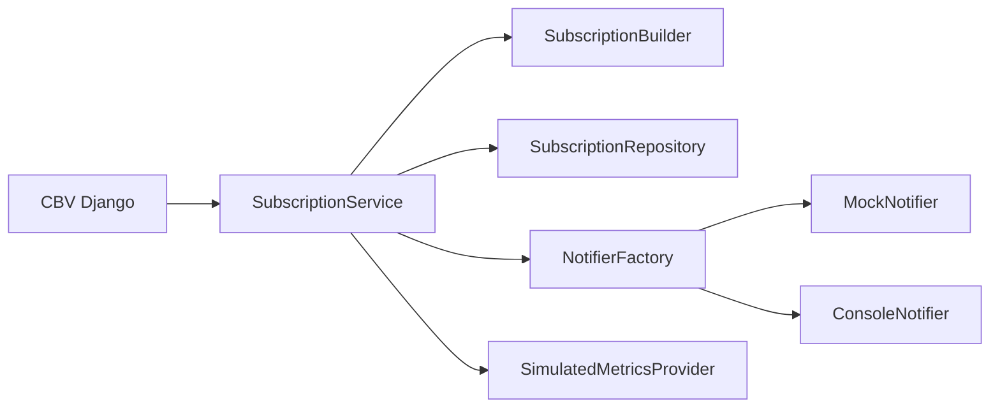

# Implementacion del Patron Creacional

## Modulo: Suscripcion y acceso a metricas

**Problema**: la logica de negocio para activar una suscripcion y habilitar metricas podria terminar mezclada en la vista con validaciones y dependencias externas.

**Solucion Arquitectonica**:

- **Service Layer**: `SubscriptionService` orquesta el flujo.
- **Factory**: `NotifierFactory` decide la estrategia de notificacion segun `ENV_TYPE`.
- **Builder**: `SubscriptionBuilder` construye una suscripcion valida con interfaz fluida.

## Interaccion entre capas



## Snippet clave

```python
# application/services.py
subscription = (
    SubscriptionBuilder()
    .for_user(user_id)
    .with_plan(plan)
    .starts_now()
    .build()
)
repository.save(subscription)
notifier.send_subscription_activated(subscription)
```

## Justificacion de diseno

- Se aplica **SRP** separando transporte HTTP, reglas de negocio y adaptadores de infraestructura.
- Se aplica **OCP**: es posible agregar nuevos planes, repositorios o notificaciones sin romper la vista.
- Se aplica **DIP**: el service depende de abstracciones (`ports`), no de implementaciones concretas.
- Se facilita testeo unitario y de integracion ligera al mantener dependencias intercambiables.
