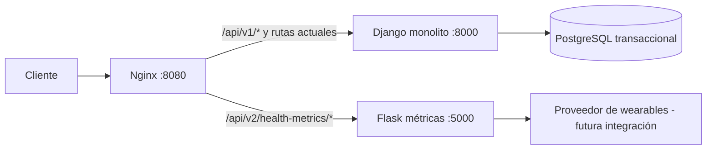

# Migración a Microservicios (Strangler Pattern)

## Decisión

GearPulse conservará el monolito Django como punto de entrada del dominio transaccional y
extraerá la generación de métricas de salud a un servicio Flask. Esta separación permite
evolucionar la integración con wearables y el cálculo de métricas sin desplegar ni saturar
los flujos de usuarios, dispositivos y suscripciones.

| Módulo | Frecuencia de cambio | Consumo de recursos esperado | Acoplamiento | Decisión |
| --- | --- | --- | --- | --- |
| Cuentas y registro | Bajo | Bajo | Alto: identidad usada por todos los módulos | Mantener en Django |
| Dispositivos y sesiones | Medio | Medio | Alto: requiere usuario y persistencia relacional | Mantener en Django |
| Suscripciones y planes | Medio | Bajo | Alto: controla activación y estado transaccional | Mantener en Django |
| Métricas de salud | Alto: nuevas fuentes y fórmulas | Alto/variable: lecturas de wearables, agregados y análisis | Bajo tras recibir `user_id` | **Estrangular a Flask** |

### Justificación

El módulo de métricas cambia con mayor frecuencia porque debe incorporar fuentes externas de
datos y reglas de cálculo. Además, sus futuras consultas pueden incluir agregaciones de grandes
volúmenes de telemetría. Al aislarlo, una carga alta o un fallo de proveedor no bloquea la
activación de suscripciones, registro de usuarios ni emparejamiento de dispositivos. La API v2
recibe sólo el identificador de usuario y devuelve JSON; por ello no comparte modelos ni acceso
directo a la base de datos Django. La validación de una suscripción activa permanece en la ruta
v1 durante la transición y se podrá migrar mediante un contrato o token de servicio en una fase
posterior.

## Topología resultante



## Contratos y ruteo

| Ruta pública | Destino | Propósito |
| --- | --- | --- |
| `GET /api/v1/subscription/<user_id>/metrics/` | Django | Ruta legacy, conservada mientras ocurre la migración. |
| `GET /api/v2/health-metrics/<user_id>/` | Flask | Nueva ruta estrangulada. Devuelve `user_id`, métricas, fecha ISO 8601 y origen. |
| `POST /api/v2/health-metrics/` | Flask | Recibe JSON `{"user_id": "..."}` y devuelve las métricas. Datos inválidos responden `400` JSON. |
| `GET /health` (red interna) | Flask | Health check del microservicio. |

Nginx bifurca el tráfico por URL. Las rutas bajo `/api/v1/` eliminan ese prefijo al
reenviarse al monolito para mantener compatibilidad con sus rutas actuales; la ruta v2 mantiene
el URI completo para Flask. Ambos servicios se construyen con Dockerfiles independientes y se
levantan con `docker compose up --build`. Compose incorpora PostgreSQL como servicio `db`;
Django espera su health check antes de ejecutar migraciones y Nginx espera que el health check
de Flask responda correctamente. SQLite se conserva únicamente como configuración predeterminada
para ejecutar las pruebas locales sin Docker.

## Resiliencia

Flask devuelve JSON también ante errores: un recurso desconocido responde `404` con
`{"error": "Not Found", "status": 404}`, y las excepciones no controladas responden `500`
sin revelar detalles internos. El microservicio no importa código Django, lo que limita el radio
de impacto de sus dependencias y permite escalarlo de forma independiente.

## Validación

```powershell
docker compose up --build -d
docker compose ps

# Monolito por la ruta legacy
Invoke-RestMethod http://localhost:8080/api/v1/plans/

# Microservicio Flask estrangulado
Invoke-RestMethod http://localhost:8080/api/v2/health-metrics/user-123/

# Contrato JSON del microservicio
Invoke-RestMethod -Method Post `
  -Uri http://localhost:8080/api/v2/health-metrics/ `
  -ContentType 'application/json' `
  -Body '{"user_id":"user-123"}'

# Pruebas aisladas de ambos servicios
docker compose exec -T health_metrics_service python -m unittest flask_metrics_service.test_app
docker compose exec -T django_web python manage.py test accounts subscriptions devices
```
